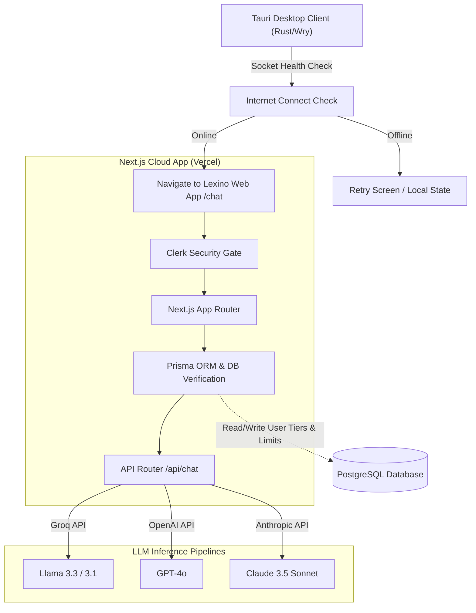

# 🌌 Lexino AI

> **The Futuristic, Premium AI Workspace Ecosystem & Desktop Assistant**

Lexino AI is a design-forward, intelligent digital workspace built to empower students, creators, and professionals. Developed by **Sumit Ravindra Choudhary** (Full Stack Developer & CEO of Lexino AI), this platform fuses a feature-rich Next.js web application with a high-performance Tauri-powered desktop application wrapper.

---

## 🌟 Key Features

### 1. Multi-Model AI Capabilities
*   **Provider Integration**: Connects seamlessly with **Groq** (using Llama 3.1 & 3.3), **OpenAI** (GPT-4o), and **Anthropic** (Claude 3.5 Sonnet).
*   **Adaptive Fallbacks**: Built-in automatic API fallbacks to ensure zero-downtime conversation streams.

### 2. Custom Persona Engine (LAIs)
*   **Lexino AI (Default)**: A calm, futuristic, highly efficient companion with minimal token footprint.
*   **Timetable AI**: An elite academic mentor and study architect utilizing **Active Recall**, **Spaced Repetition**, and **Pomodoro** study patterns, designed with Gen-Z empathy and burnout prevention.
*   **ChatGPT & Claude Modes**: Direct personality/response-style templates formatting responses to mimic GPT-4o's direct lists or Claude's logical, long-form depth.

### 3. Tauri-Powered Desktop Client
*   **Smart Connection Detector**: Native Rust client wrapper checks network socket health before initiating the UI.
*   **Offline-Safe Redirection**: Automatically routes directly to the cloud dashboard when connection is restored.
*   **System Integration**: Handles file-system triggers, external system links via `tauri-plugin-shell`, and auto-updating via `tauri-plugin-updater`.

### 4. Subscription & Usage Safeguards
*   **Clerk Authentication**: Full identity management with secure login/signup.
*   **Prisma Database Hook**: Tracks user tiers (`FREE`, `STUDENT`, `PRO`) and dynamically enforces daily request quotas and rate-limiting cooldown periods.

---

## 🛠️ Architecture



---

## 🚀 Tech Stack

*   **Frontend**: Next.js (App Router), React 19, TypeScript, Vanilla CSS, Highlight.js (syntax highlighting), Marked (markdown parsing).
*   **Desktop App Wrapper**: Tauri v2, Rust.
*   **Authentication**: Clerk Security Suite (`@clerk/nextjs`).
*   **Database & ORM**: Prisma Client, PostgreSQL.
*   **AI Integration**: OpenAI SDK, Anthropic SDK, Groq APIs.

---

## 📂 Project Structure

```bash
Lexino-AI/
├── src-tauri/             # Tauri v2 Desktop Wrapper configuration & Rust source
│   ├── src/
│   │   ├── main.rs        # Tauri entrypoint
│   │   └── lib.rs         # Tauri commands, network check & browser handlers
│   └── tauri.conf.json    # Build commands and package updater configs
├── website/               # Next.js Web App
│   ├── app/               # Next.js App Router (chat, login, admin, API routes)
│   │   ├── api/chat/      # Serverless route with streaming and quota logic
│   │   └── chat/          # Primary interactive dashboard
│   ├── components/        # UI layout, sidebars, modal frames
│   ├── Lexino Website/    # Landing page static HTML/CSS template assets
│   ├── prisma/            # DB configuration & database models (schema.prisma)
│   └── package.json       # React 19 dependencies & scripts
└── README.md              # Project documentation
```

---

## ⚙️ Setup & Installation

### 💻 1. Web Application (`website/`)

1.  **Navigate into the web directory**:
    ```bash
    cd website
    ```
2.  **Install dependencies**:
    ```bash
    npm install
    ```
3.  **Configure environment variables**:
    Create a `.env` file referencing `.env.example`:
    ```env
    DATABASE_URL="postgresql://..."
    NEXT_PUBLIC_CLERK_PUBLISHABLE_KEY="..."
    CLERK_SECRET_KEY="..."
    GROQ_API_KEY="..."
    OPENAI_API_KEY="..."
    ANTHROPIC_API_KEY="..."
    ```
4.  **Run migrations and start local development server**:
    ```bash
    npx prisma db push
    npm run dev
    ```

### 🖥️ 2. Desktop Application (`src-tauri/`)

1.  **Ensure you have Rust and Tauri pre-requisites installed**:
    Follow [Tauri's setup instructions](https://v2.tauri.app/start/prerequisites/).
2.  **Install project level CLI dependencies**:
    ```bash
    npm install
    ```
3.  **Run the Tauri development build**:
    ```bash
    npm run tauri dev
    ```

---

## 👤 Developer & Founder

*   **Sumit Ravindra Choudhary** — *Full Stack Developer, AI Systems Builder, and Founder & CEO of Lexino AI*.
*   GitHub Repository: [Codewithrony1/Lexino-AI](https://github.com/Codewithrony1/Lexino-AI)
